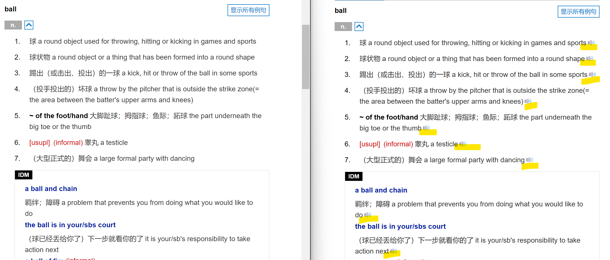
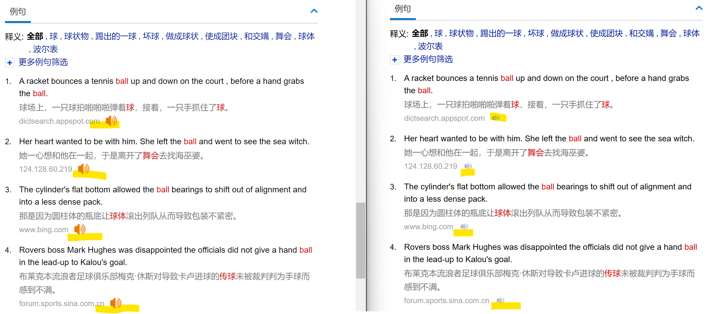

<h1 align="center">bing-dict-edge-tts</h1>

这是一个可以把浏览器 bind 词典句子发音替换换 Edge-TTS 发音引擎的工具

    

# 功能介绍
这个插件可以帮助我们在浏览器使用 bing 词典的时候，把生硬的机器发音替换为媲美真人发音的 Edge-TTS 发音引擎，可以让我们的查词以及学习有更好的体验；

 

发音差异对比

<audio controls>
  <source src="assets/diff3.mp3" type="audio/mp3">
  Your browser does not support the audio element.
</audio>
<audio controls>
  <source src="assets/diff4.mp3" type="audio/mp3">
  Your browser does not support the audio element.
</audio>

 

界面差异对比

 

# 怎么使用？
 1. 进入浏览器拓展管理页面；
 2. 打开浏览器开发者选项；
 3. 加载已解压的拓展程序；
 4. 选择 src 目录；

 

# 已实现功能
 - ✅ 可以使用 Edge-TTS 语音引擎对 bing 词典的句子进行发音；
 - ✅ 原有词典中大部分没有发音的例句也可以发音了；
 
 

# 已知问题
 - ⚠️ 目前只能在在 Edge 浏览器中使用；
 - ⚠️ 在翻页时例句发音图标会还原成原来的样子；

 

# 感谢

感谢 [edge-tts](https://github.com/M86xKC/edge-tts) 提供了最基础的调用 Edge-TTS 发音引擎的技术实现；
 
